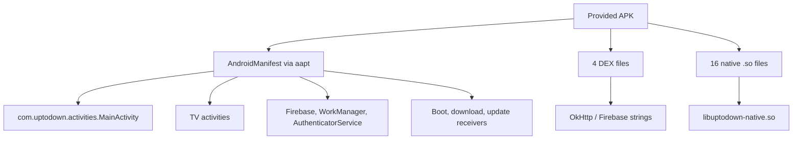

# Offline APK reverse analysis report

> Analysis date: 2026-09-21  
> Skill route: `reverse-skill-router` -> `apk-reverse` -> `docs-generator`  
> Flavor: `null` reverse-engineering report, not malware/APT  
> Scope: [`work/suunto-apk-modernization/scope.md`](../../work/suunto-apk-modernization/scope.md)

## Executive summary

The provided file `C:\Users\ARCANA\Downloads\uptodown-com.stt.android.suunto.apk` was analyzed offline. The APK identifies as `com.uptodown`, application label `Uptodown App Store`, version `7.39`, not as the official Suunto Android application. It has broad app-store style permissions for package querying, APK installation/deletion, storage, accounts, notifications, and boot receivers.

The APK contains 4 DEX files, 16 native libraries across 4 ABIs, and package-specific native modules named `libuptodown-native.so` and `libutd-services-native.so`. Because `jadx` and `apktool` were unavailable and bootstrap failed with HTTP 403, this pass is a triage-level static analysis using Android SDK tools and DEX string extraction. Do not use this APK as the baseline for Suunto-specific modernization unless the intended goal is actually to modernize an Uptodown-style app store.

## Target overview

| Property | Value |
|---|---|
| File | `C:\Users\ARCANA\Downloads\uptodown-com.stt.android.suunto.apk` |
| Size | 15,554,334 bytes |
| SHA-256 | `9277f5ec9ba2b5341e7734ef30202a8b6fc6f7415babafe043b3960293622c33` |
| Package | `com.uptodown` |
| Label | `Uptodown App Store` |
| Version | `7.39` / versionCode `739` |
| minSdk / targetSdk | `23` / `36` |
| Launch activity | `com.uptodown.activities.MainActivity` |
| TV launch activity | `com.uptodown.tv.ui.activity.TvMainActivity` |
| Native ABIs | `arm64-v8a`, `armeabi-v7a`, `x86`, `x86_64` |

## Evidence chain

| E-id | Source | Reproduce | Artifact |
|---|---|---|---|
| E-001 | `aapt dump badging` | `aapt dump badging C:\Users\ARCANA\Downloads\uptodown-com.stt.android.suunto.apk` | `evidence/raw/aapt-badging.txt` |
| E-002 | `aapt dump permissions` | `aapt dump permissions C:\Users\ARCANA\Downloads\uptodown-com.stt.android.suunto.apk` | `evidence/raw/aapt-permissions.txt` |
| E-003 | ZIP/DEX parser | `python suunto-modernization\scripts\analyze_apk.py ...` | `evidence/apk-summary.json` |
| E-004 | `apksigner verify --print-certs` | `apksigner verify --print-certs C:\Users\ARCANA\Downloads\uptodown-com.stt.android.suunto.apk` | `evidence/raw/apksigner-verify.txt` |

## Findings

### F-001: Baseline mismatch

- severity: `info`
- status: validated
- evidence_ids: [E-001, E-003]
- confidence: high
- location: APK manifest/package metadata
- Finding: The file name suggests a Suunto APK, but the package, label, classes, native libraries, and signing certificate all point to Uptodown.
- Impact: Suunto-specific feature modernization cannot be planned reliably from this sample.

### F-002: Broad package-management permission surface

- severity: `info`
- status: candidate
- evidence_ids: [E-001, E-002]
- confidence: high
- location: Android manifest permissions
- Finding: The app requests app-store oriented permissions including `REQUEST_INSTALL_PACKAGES`, `REQUEST_DELETE_PACKAGES`, `QUERY_ALL_PACKAGES`, `MANAGE_EXTERNAL_STORAGE`, account permissions, boot receivers, notifications, microphone, biometrics, and advertising services.
- Impact: Any modernization should include permission minimization, transparent onboarding, and privacy controls.

### F-003: Native logic requires deeper tooling

- severity: `n/a_re`
- status: candidate
- evidence_ids: [E-003]
- confidence: medium
- location: `lib/*/libuptodown-native.so`, `lib/*/libutd-services-native.so`
- Finding: Native libraries are present for all common Android ABIs. Business or security-sensitive behavior may exist outside Java/Kotlin DEX.
- Impact: A deeper pass should add `jadx`, `apktool`, and a native analyzer before patching or reimplementation decisions.

## Component map

## Modernization implications

For a real Suunto app modernization, the first action is to replace this sample with the correct Suunto APK or source repository. For an Uptodown-style app store modernization, the strongest improvement areas are:

1. Reduce the initial permission footprint and ask only at the point of use.
2. Make install/delete/update flows auditable and reversible.
3. Add a privacy dashboard for package visibility, ad ID usage, notifications, and account linkage.
4. Improve offline download management and retry behavior.
5. Separate TV and mobile UI flows cleanly while sharing domain logic.
6. Add native-library review before changing update, install, or trust logic.

## Path

### P-001: Offline triage path

- path_type: callflow
- Start: local APK file
- Goal: decide whether this APK can seed a Suunto modernization project
- Steps:
  1. Inspect package and launch metadata with `aapt` -> E-001 -> F-001
  2. Inspect permission surface with `aapt` -> E-002 -> F-002
  3. Index APK entries, DEX strings, and native libraries -> E-003 -> F-003
  4. Verify signer certificate metadata -> E-004 -> F-001

## Timeline

See [`work/suunto-apk-modernization/timeline.md`](../../work/suunto-apk-modernization/timeline.md). This pass created scope, routed to `apk-reverse`, collected static artifacts, and produced this modernization workspace.

## Limitations

- No device or emulator was used.
- No network traffic was generated.
- No app patching, signing, or installation was performed.
- `jadx` and `apktool` are still needed for source-level and smali-level modernization work.
